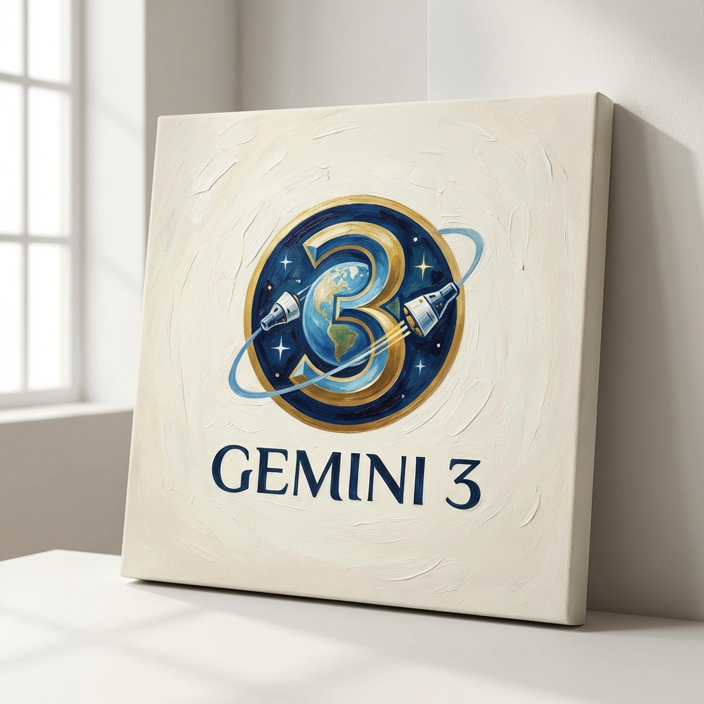
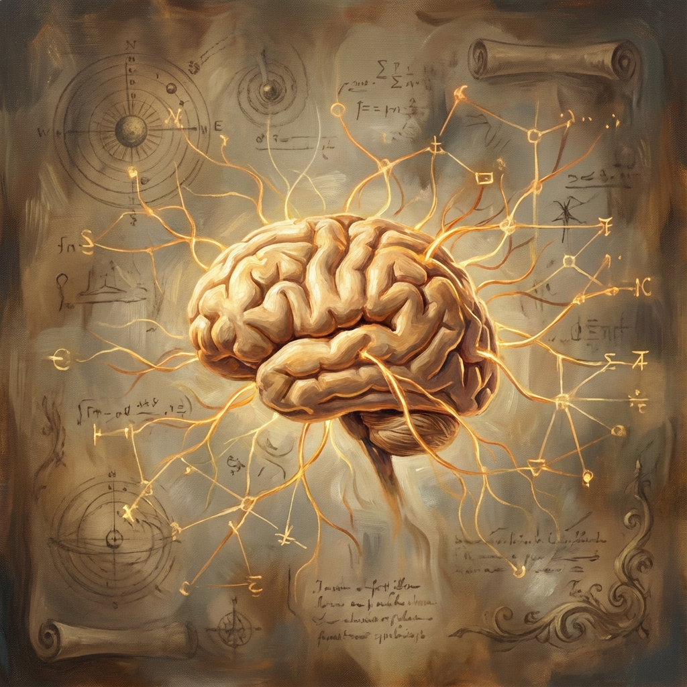

2025 年 11 月 18 日，Google 正式发布了 **Gemini 3**，这标志着我们正式进入了 "Gemini 3 时代"。作为 Google 迄今为止最智能、最强大的 AI 模型，Gemini 3 不仅在多模态推理上实现了质的飞跃，更重新定义了人机交互的未来。

## 核心突破：PhD 级推理能力

Gemini 3 引入了全新的 **Deep Think** 模式。这不仅仅是计算能力的提升，更是逻辑推理能力的进化。

在最新的基准测试中，Gemini 3 Pro 展现出了 **PhD 级别的推理能力**。无论是在复杂的数学证明、科学研究，还是在跨模态的逻辑分析中，它都设定了新的行业标准。

*   **多模态深度理解**：它不再只是“看”图或“听”音，而是能真正理解其中的逻辑关联。
*   **长程规划**：面对复杂的任务链，Gemini 3 能像人类专家一样进行拆解、规划和分步执行。

## Agentic Coding 与 "Vibe Coding"

对于开发者而言，Gemini 3 带来了革命性的 **Agentic Coding** 体验。

Google 称其为 "Vibe Coding" —— 你只需要描述你的想法或“感觉”，Gemini 3 就能从零开始构建整个应用程序。

*   **一句话构建应用**：从单个 Prompt 到完整的全栈应用，Gemini 3 能自动处理依赖、编写代码、甚至部署。
*   **Google Antigravity**：作为全新的智能体开发平台，Antigravity 深度集成了 Gemini 3，让 AI 能够自主调用工具、管理任务，甚至自我修正代码中的错误。

## Generative UI：交互的未来

Gemini 3 不再局限于文本或静态图片的输出。它引入了 **Generative UI** 的概念。

当你在查询数据时，它不会只给你一张表格，而是可能直接生成一个可交互的仪表盘；当你在设计产品时，它能直接渲染出可点击的原型。AI 的输出形式将根据你的需求动态生成，打破了传统 UI 的界限。

## 安全与未来

在追求强大的同时，Google 也强调 Gemini 3 是迄今为止**最安全**的模型。经过广泛的安全评估，它在抵御 Prompt 注入攻击和减少“幻觉”方面有了显著提升。

Gemini 3 的发布，不仅仅是一次版本更新，它预示着 AI 正从“聊天机器人”向“全能智能体”转变。无论是科研探索、软件开发，还是日常生活的助手，Gemini 3 都将成为我们最得力的伙伴。

---
*本文基于 2025 年 11 月的最新发布信息整理。*
